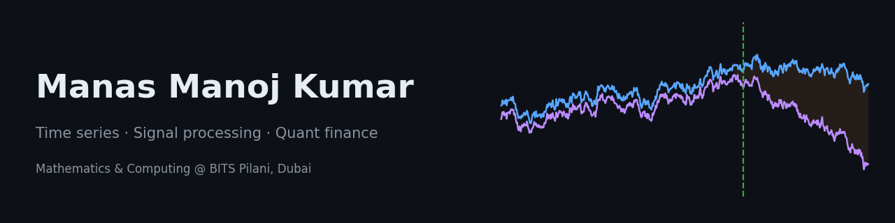
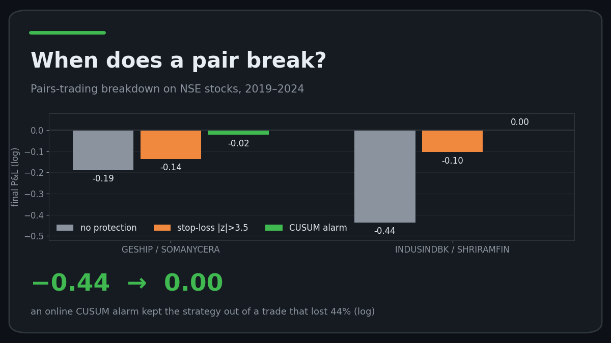
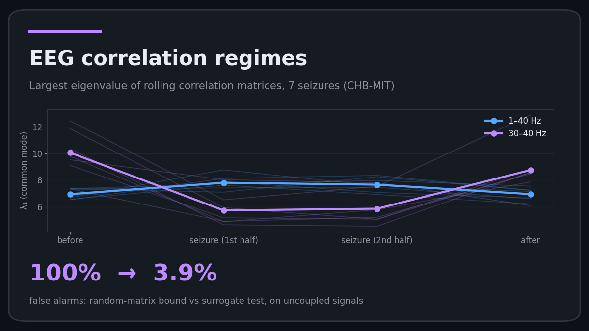

  

  
  

I'm a second-year Mathematics & Computing student who likes one kind of question: **when does a relationship in noisy data actually change, and how would you know in real time?** I test that on markets and on brain signals, and I aim to be a quant.

## Projects

<table>
<tr>
<td width="50%" align="center">

 <b>Pairs-trading breakdown detection (NSE)</b>
 Cointegrated pairs still lost money out of sample. An online CUSUM alarm spotted the breakdown before a stop-loss did.
</td>
<td width="50%" align="center">

 <b>Correlation regimes around seizures</b>
 Rolling λ₁ of EEG correlation matrices. Random-matrix bounds break under autocorrelation; surrogate tests don't.
</td>
</tr>
</table>

🌦️ Also: [weather-instrument](https://github.com/manas-mk/weather-instrument), a no-backend weather + CPCB AQI web app.

## Toolbox

**Maths I use:** probability & statistics · linear algebra · time-series analysis · hypothesis testing · change-point detection · random matrix theory

## Currently learning

📈 Stochastic processes · time-series econometrics · portfolio theory (MIT 18.S096)
